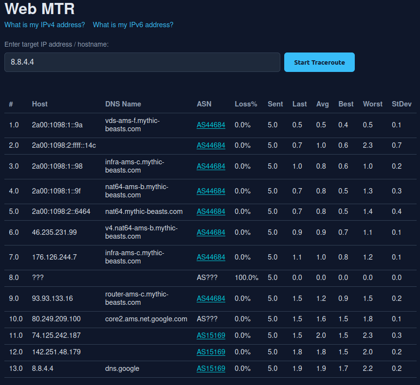

# Web MTR

## Usage

```text
# Start the container
docker compose up -d

# Logs are sent to a file
tail -f logs/access.log
```

GET JSON output by calling the API directly:

```text
curl -s http://localhost:8371/traceroute?target=8.8.8.8 | jq
```

Open browser to <http://localhost:8371> to use the UI:

[](screenshot.png)

## Overview

This folder contains a basic web based traceroute.

It is a single page web application which performs traceroute to an IP/hostname and displays the results in a user-friendly format.

The web application is built as follows:

* A single python script which runs the CLI command `mtr` and returns the results in JSON format.
* UV is used to managed python dependencies and virtual environments.
* An ICMP/v6 traceroute is performed.
* Passes the JSON output and displays it in a web page.
* The web page has a single input field for the user to enter the target IP/hostname and a button to start the traceroute.
* The input field has a default value of the caller's IP address.
* Two links are provided, one to ipv4.53bits.co.uk, and one to ipv6.53bits.co.uk (both open in a new tab), which the user can use to check their IP address.
* The script runs the following MTR command: `mtr -j -c 10 <target>`, where `<target>` is the user input.
* Gunicorn is used to run the web application and control the number of worker processes.
* The application will run on port 8371.
* The port and other settings are defined in a `.env` file.
* The application is packaged as a Docker image for easy deployment.
* A docker compose file is provided to run the application with a single command.
* Capability NET_RAW is required for `mtr` to have ICMP privileges.

## Bindings

If you want to bing to a specific IPv6 address, set the `LISTEN_ADDR` env var using square bracket syntax: `LISTEN_ADDR=[fe80::1122:3344:5566:7788]`

## NAT64

If running on an IPv6 only host which uses NAT64 to provide IPv4 connectivity, ensure the `NAT64` env var contains the prefix of the NAT64 network, e.g. `NAT64=64:ff9b::/96`. Leave this var defined but empty if on a dual stack host.

With this env var set:

* When an IPv4 address is entered as the target, it will be converted to a NAT64 address and the traceroute will be performed using that address.
* When a traceroute is run to a NAT64 prefix (due to an IPv4 literal target or DNS64) the IPv4 addresses of each hop in the results are extracted from the mtr output and displayed as IPv4 addresses, along with their reverse DNS lookup result, and the ASN of the IPv4 address; rather than the NAT64 addresses (which have no reverse DNS or ASN information).

## Tests

```text
uv run pytest src/tests.py -q
```
